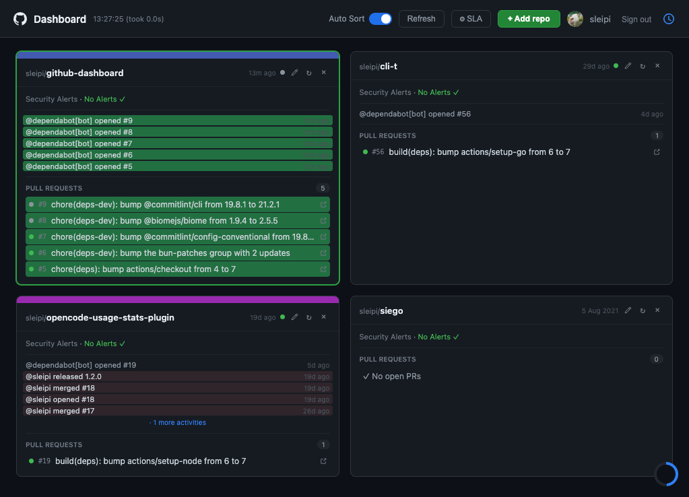

# GitHub Dashboard

A local, self-hosted GitHub dashboard showing your pinned repositories at a glance — open PRs, CI status, and Dependabot alerts, auto-refreshed every 10 seconds.

Runs entirely on your machine. No cloud, no accounts, no tracking. Your GitHub token stays local.



## Features

- **PR overview** — open pull requests with CI status per PR
- **Dependabot alerts** — alert count with 1W / 1M / 6M trend
- **Auto-refresh** — cards update every 10 seconds via HTMX
- **Drag & drop** — reorder your pinned repos
- **Local SQLite** — all data cached locally, no localStorage

## Requirements

- [Bun](https://bun.sh) ≥ 1.2
- A GitHub [Personal Access Token (classic)](https://github.com/settings/tokens) with scopes:
  - `repo` — private repos, pull requests
  - `security_events` — Dependabot alerts

## Installation

```bash
git clone https://github.com/your-username/github-dashboard
cd github-dashboard
bun install
```

## Usage

```bash
bun run dev       # Start with file-watching (development)
bun run start     # Start server
```

Open [http://localhost:4242](http://localhost:4242) in your browser.

On first launch you'll be prompted for your GitHub token. It's stored locally in `~/.github-dashboard.db`.

### Custom database path

```bash
GH_DASH_DB=/path/to/my.db bun run start
```

Useful to try the dashboard against a throwaway test DB without touching your real data:

```bash
GH_DASH_DB=./demo.db bun run src/index.ts
```

### Custom port

```bash
PORT=8080 bun run start
```

## Development

```bash
bun run check        # Lint + format (Biome)
bun run check:fix    # Auto-fix
bun x tsc --noEmit   # Type check
bun test tests/unit  # Unit tests
bun run test:e2e     # E2E tests (Playwright)
```

## Architecture

```
src/
  db/          SQLite repositories (auth, cards, PRs, Dependabot)
  github/      GitHub API client
  services/    Business logic (card service, trend calculation)
  routes/      HTTP route handlers
  templates/   TypeScript functions → HTML strings
  server.ts    Bun.serve wrapper
  index.ts     Composition root
```

See [`docs/superpowers/specs/`](docs/superpowers/specs/) for the full architecture design.

## Contributing

Commits follow [Conventional Commits](https://www.conventionalcommits.org/).
Pre-commit hooks run lint, type check and unit tests automatically.

## License

MIT
